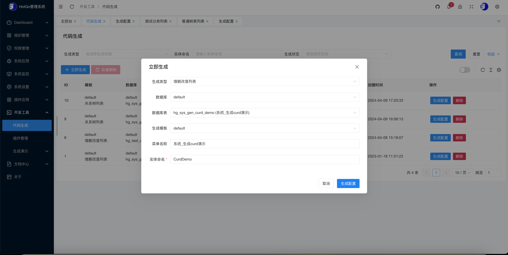
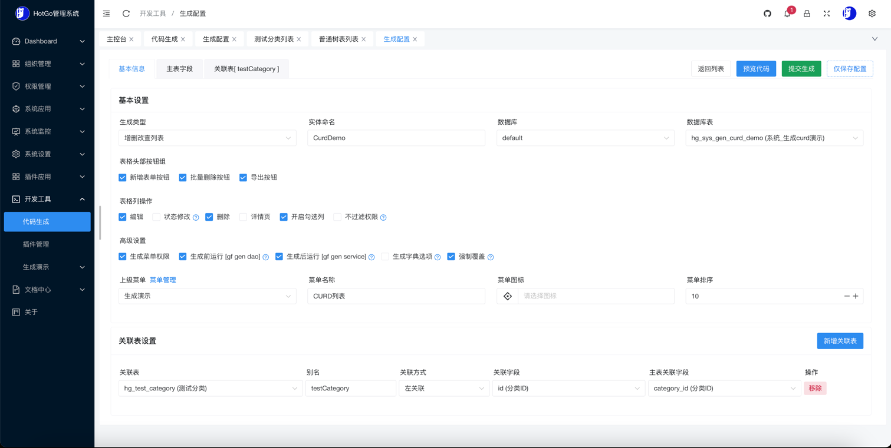
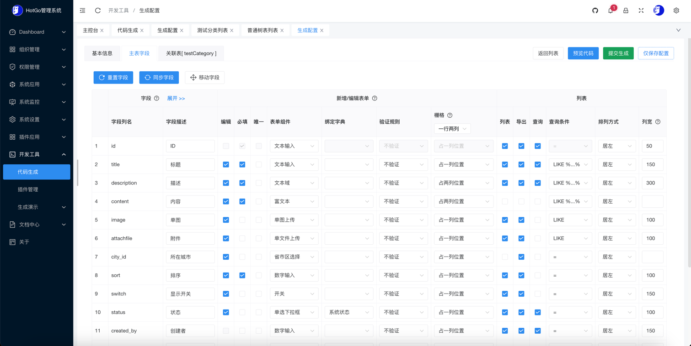
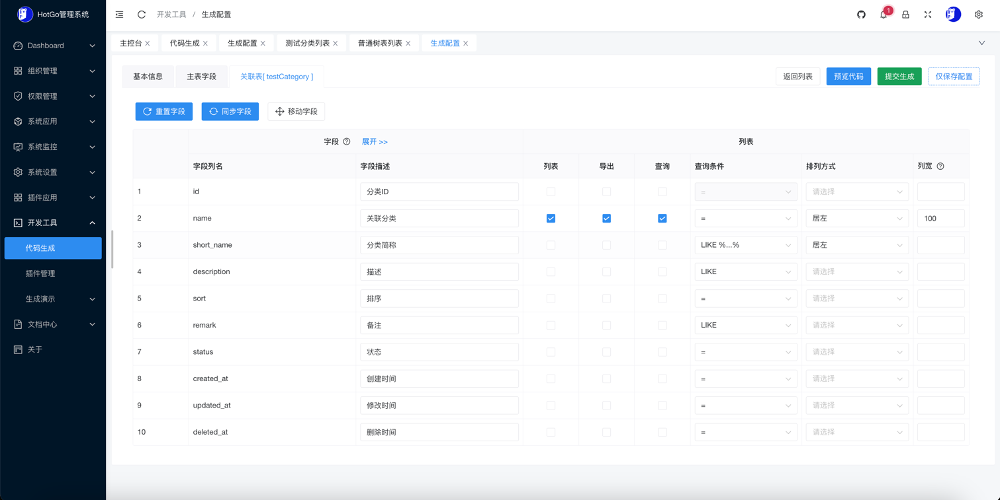
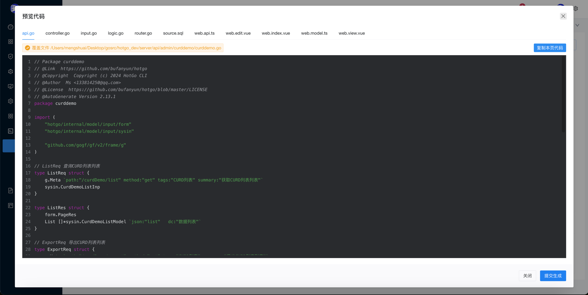

## 生成关联表CURD

### 热编译启动
- 推荐使用热编译方式启动HotGo，这样生成完成页面自动刷新即可看到新生成内容，无需手动重启

```shell
# 服务端
cd server 
gf run main.go

# web端
cd web
yarn dev
```

以下是一个关联表的CURD生成流程

### 创建表结构
- 以下表结构和数据为了方便功能演示已经内置无需再次创建


- 创建主表：hg_sys_gen_curd_demo
```sql
CREATE TABLE `hg_sys_gen_curd_demo` (
  `id` bigint(20) NOT NULL AUTO_INCREMENT COMMENT 'ID',
  `category_id` bigint(20) DEFAULT '0' COMMENT '分类ID',
  `title` varchar(64) NOT NULL COMMENT '标题',
  `description` varchar(255) DEFAULT '' COMMENT '描述',
  `content` text COMMENT '内容',
  `image` varchar(255) DEFAULT NULL COMMENT '单图',
  `attachfile` varchar(255) DEFAULT NULL COMMENT '附件',
  `city_id` bigint(20) DEFAULT '0' COMMENT '所在城市',
  `switch` int(11) DEFAULT '1' COMMENT '显示开关',
  `sort` int(11) DEFAULT NULL COMMENT '排序',
  `status` tinyint(1) DEFAULT '1' COMMENT '状态',
  `created_by` bigint(20) DEFAULT '0' COMMENT '创建者',
  `updated_by` bigint(20) DEFAULT '0' COMMENT '更新者',
  `created_at` datetime DEFAULT NULL COMMENT '创建时间',
  `updated_at` datetime DEFAULT NULL COMMENT '修改时间',
  `deleted_at` datetime DEFAULT NULL COMMENT '删除时间',
  PRIMARY KEY (`id`)
) ENGINE=InnoDB AUTO_INCREMENT=14 DEFAULT CHARSET=utf8mb4 COMMENT='系统_生成curd演示';
```

创建关联表：hg_test_category
```sql
CREATE TABLE `hg_test_category` (
  `id` bigint(20) NOT NULL AUTO_INCREMENT COMMENT '分类ID',
  `name` varchar(255) NOT NULL COMMENT '分类名称',
  `short_name` varchar(128) DEFAULT NULL COMMENT '简称',
  `description` varchar(255) DEFAULT NULL COMMENT '描述',
  `sort` int(11) NOT NULL COMMENT '排序',
  `remark` varchar(255) DEFAULT NULL COMMENT '备注',
  `status` tinyint(1) DEFAULT '1' COMMENT '状态',
  `created_at` datetime DEFAULT NULL COMMENT '创建时间',
  `updated_at` datetime DEFAULT NULL COMMENT '修改时间',
  `deleted_at` datetime DEFAULT NULL COMMENT '删除时间',
  PRIMARY KEY (`id`)
) ENGINE=InnoDB AUTO_INCREMENT=5 DEFAULT CHARSET=utf8mb4 COMMENT='测试分类';
```

### 表字段要求
- 使用生成时，表中必须具有以下字段和属性

| 字段名称	  | 字段含义                 | 字段类型                | 可为空 |
|--------|----------------------|---------------------|-----|
| id	    | 主键ID	                | bigint(20)      | 否   |


### 创建生成配置
- 登录HotGo后台 -> 开发工具 -> 代码生成 -> 找到立即生成按钮并打开，选择和填写如下参数：




### 基本设置
- 确认无误后，点击生成配置会跳转到生成配置页面，如下：
- 你可以在该页面调整生成表格表头/表列的接口功能、菜单权限、高级设置和关联表设置



### 主表字段设置

- 在该页面你可以调整生成表格字段名称、表单组件、表单编辑/验证项、列表展示/查询项、字段排序、重置和同步字段

    


### 关联表字段设置
- 在该页面你可以调整生成表格关联表字段名称、列表展示/查询项、字段排序、重置和同步字段
- 如果存在多个关联表，也可以对多个关联表字段进行设置

   

### 预览并生成

点击`预览代码`查看生成的代码内容。如果无需继续调整直接点击`提交生成`即可，以下是预览代码效果：



- 如果你使用的热编译，那么页面会在生成成功后立即刷新，刷新完成你即可在后台菜单栏中看到`测试表格`菜单。如果不是使用热编译启动，请手动重启服务后刷新。


### 生成完成

- 让我们看看生成的表格页面，效果如下：


### 常见问题

- [生成常见问题](code-help.md)


