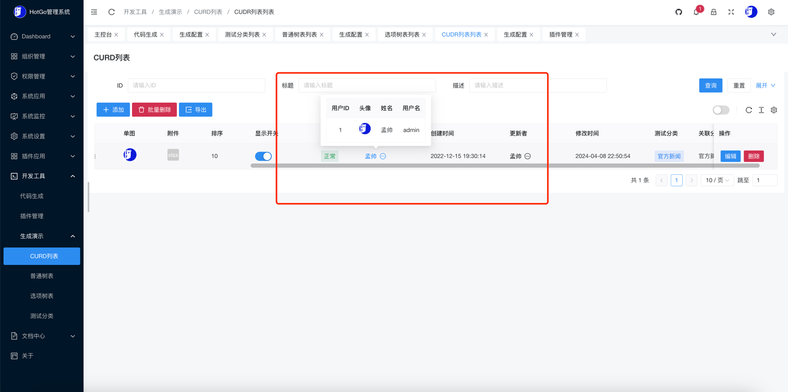
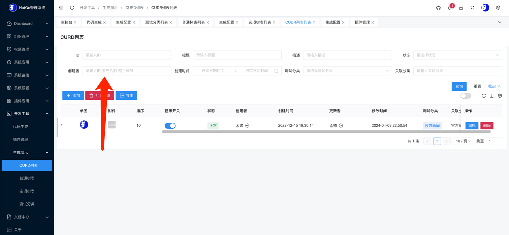

## 数据库

目录

- 字段类型
- 特殊字段默认表单组件
- 特殊字段默认表单验证器
- SQL默认查询方式
- 其他

### 字段类型

- 创建数据库表当按如下的规则进行字段命名、类型、属性设置和备注后，再生成CRUD代码时会自动生成对应的Api、控制器、业务逻辑、Web页面、[表单组件](web-form.md)等的一些默认属性
- 当你了解这些默认技巧后，会有效提高你在实际开发中的生产效率

| 数据库类型	                                                        | 额外属性         | 转换Go类型	      | 转换Ts类型  | 表单组件                  |
|---------------------------------------------------------------|--------------|--------------|---------|-----------------------|
| int, tinyint,small_int,smallint,medium_int,mediumint,serial	  | /	           | int	         | number  | InputNumber(数字输入框)    |
| int, tinyint,small_int,smallint,medium_int,mediumint,serial		 | unsigned     | uint	        | number  | InputNumber(数字输入框)    |
| big_int,bigint,bigserial	                                     | /	           | int64	       | number  | InputNumber(数字输入框)    |
| big_int,bigint,bigserial			                                   | unsigned     | uint64       | number  | InputNumber(数字输入框)    |
| real	                                                         | /	           | float32      | number  | InputNumber(数字输入框)    |
| float,double,decimal,money,numeric,smallmoney	                | /	           | float64      | number  | InputNumber(数字输入框)    |
| bit(1) 、bit(true)、bit(false)                                  | /	           | bool         | boolean | Input(文本输入框，默认)       |
| bit	                                                          | /	           | int64-bytes  | array   | InputDynamic(动态KV表单)  |
| bit	                                                          | unsigned	    | uint64-bytes | array   | InputDynamic (动态KV表单) |
| bool                                                          | /	           | bool         | boolean | Input(文本输入框，默认)       |
| date                                                          | /	           | *gtime.Time  | string  | Date(日期选择器)           |
| datetime,timestamp,timestamptz                                | /	           | *gtime.Time  | string  | Time(时间选择器)           |
| json                                                          | /	           | *gjson.Json  | string  | Input(文本输入框)          |
| jsonb                                                         | /	           | *gjson.Json  | string  | Input(文本输入框)          |
| 以下为物理类型中包含字段部分时的转换方式，默认情况                                     | /            | /            | /       | /                     |
| text,char,character                                           | 	 /	         | string       | string  | Input(文本输入框)          |
| float,double,numeric                                          | 	  /	        | string       | string  | Input(文本输入框)          |
| bool                                                          | 	       /    | 	bool        | boolean | Input(文本输入框，默认)       |
| binary,blob                                                   | 	    /	      | []byte       | string  | Input(文本输入框，默认)       |
| int                                                           | 	    /	      | int          | number  | InputNumber(数字输入框)    |
| int                                                           | 	   unsigned | int          | number  | InputNumber(数字输入框)    |
| time                                                          | /	           | *gtime.Time  | string  | Time(时间选择器)           |
| date                                                          | /	           | *gtime.Time  | string  | Date(日期选择器)           |
| 没有满足以上任何条件的                                                   | /	           | string       | string  | Input(文本输入框)          |


### 特殊字段默认表单组件
- 以下字段在不设置表单组件时会默认使用的表单组件

| 数据库字段	       | 字段名称                 | 表单组件                 |
|--------------|----------------------|----------------------|
| status	      | 状态字段（任意int类型）	       | Select (单选下拉框)       |
| created_at	  | 创建时间字段	              | TimeRange (时间范围选择)   |
| province_id	 | 省份ID字段（任意int类型）	     | CitySelector (省市区选择) |
| city_id	     | 城市ID字段（任意int类型）	     | CitySelector (省市区选择) |
| 任意字串符字段	     | 长度>= 200 and <= 500	 | InputTextarea (文本域)  |
| 任意字串符字段	     | 长度> 500	             | InputEditor (富文本)    |


### 特殊字段默认表单验证器
- 以下字段在不设置表单组件时会默认使用的表单验证器

| 数据库字段/Go类型	       | 字段名称   | 表单验证规则                |
|-------------------|--------|-----------------------|
| mobile	           | 手机号    | 不为空时必须是手机号码（国内）       |
| qq	               | QQ	    | 不为空时必须是QQ号码           |
| email	            | 邮箱地址   | 不为空时必须是邮箱格式           |
| id_card	          | 身份证号码  | 不为空时必须是15或18位身份证号码    |
| bank_card	        | 银行卡号码	 | 银行卡号码                 |
| password	         | 密码	    | 密码验证，必须包含6-18为字母和数字   |
| price	            | 价格	    | 金额验证，最多允许输入10位整数及2位小数 |
| Go类型为uint、uint64	 | 正整数	   | 非零正整数验证               |

### SQL默认查询方式
- Go类型取决于数据库物理类型，请参考 [字段类型] 部分

| Go类型	                   | 查询方式                                 |
|-------------------------|--------------------------------------|
| string	                 | LIKE                                 |
| date,datetime	          | =                                    |
| int,uint,int64,uint64	  | =                                    |
| []int,[]int64,[]uint64	 | IN (...)                             |
| float32,float64	        | =                                    |
| []byte4	                | =(默认)                                |
| time.Time,*gtime.Time	  | =                                    |
| *gjson.Json	            | JSON_CONTAINS(json_doc, val[, path]) |


### 其他

#### 默认字典选项

- 数据库字段为 `status`且类型为任意数字类型的会使用系统默认的状态字典

#### 默认属性

- 默认必填，当数据库字段存在非空`IS_NULLABLE`属性时，默认勾选必填验证
- 默认唯一，当数据库字段索引存在`UNI`时，默认勾选唯一值验证
- 默认主键，当数据库字段索引存在`PRI`时，默认为主键，不允许编辑
- 默认排序，当数据库字段存在`sort`时，默认开启排序，添加表单自动获取最大排序增量值并填充表单
- 默认列名，默认使用字段注释作为表格的列名。当数据库字段未设置注释时，默认使用字段名称作为列名

#### 自动更新/插入

- 自动更新，当数据库字段为`updated_at`(更新时间),`updated_by`(更新者)
- 自动插入，当数据库字段为`created_at`(创建时间),`created_by`(创建者)
- 软删除，表存在字段`deleted_at`时，使用表的Orm模型查询条件将会自动加入[ `deleted_at` IS NULL ]，删除时只更新删除时间而不会真的删除数据
- 树表：不论更新插入，都会根据表中字段`pid`(上级ID)自动维护`level`(树等级)和`tree`(关系树)


#### 操作人字段维护

- 生成列表中存在并且勾选展示字段`created_by`(创建者)、`updated_by`(修改者)、`deleted_by`(删除者)时，会自动到表`hg_admin_member`中获取操作人的基本信息摘要，并渲染到列表中，效果如下：



- 生成列表中存在并且勾选查询字段`created_by`(创建者)、`updated_by`(修改者)、`deleted_by`(删除者)时，会强制将查询表单改为关键词查询，从`hg_admin_member`查询操作人。效果如下：
  


- 查询代码片段，参考路径：[server/internal/logic/admin/member.go](../../server/internal/logic/admin/member.go)
```go

// 查询创建者
if in.CreatedBy != "" {
  ids, err := service.AdminMember().GetIdsByKeyword(ctx, in.CreatedBy)
  if err != nil {
    return nil, 0, err
  }
  mod = mod.WhereIn(dao.SysGenCurdDemo.Columns().CreatedBy, ids)
}

// GetIdsByKeyword 根据关键词查找符合条件的用户ID
func (s *sAdminMember) GetIdsByKeyword(ctx context.Context, ks string) (res []int64, err error) {
  ks = gstr.Trim(ks)
  if len(ks) == 0 {
    return
  }
  array, err := dao.AdminMember.Ctx(ctx).Fields("id").
    Where("`id` = ? or `real_name` = ? or `username` = ? or `mobile` = ?", ks, ks, ks, ks).
    Array()
  if err != nil {
    err = gerror.Wrap(err, "根据关键词获取用户ID失败，请稍后重试！")
  }
  res = gvar.New(array).Int64s()
  return
}
```


> 这里只列举了较为常用的默认规则，其他更多默认规则请参考：[server/internal/library/hggen/views/column_default.go](../../server/internal/library/hggen/views/column_default.go)
